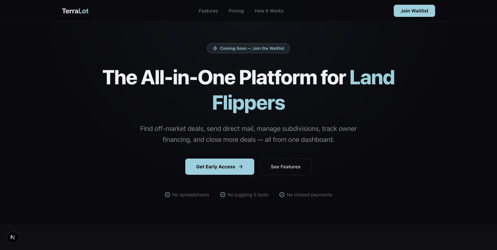
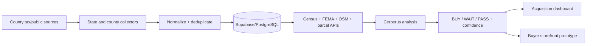

# TerraLot

An evidence-aware land-acquisition research system for sourcing, enriching, underwriting, and reviewing U.S. vacant-land opportunities. The repository combines an operations dashboard, a county/public-record ingestion fleet, a buyer-facing storefront prototype, and the research documents behind the product strategy.

[](https://github.com/moriana55/terralot-v2/actions/workflows/ci.yml)
[](docs/showcase-audit.md)
[](docs/showcase-audit.md)
[](LICENSE)

> Portfolio status: 66 dashboard domain tests, 3 scraper safety tests, dashboard and storefront production builds, three dependency audits, and credential-pattern scans are verified locally and repeated by public CI. External parcel APIs, live Supabase data, Clerk authentication, and county-source ingestion require owner credentials and remain explicit deployment gates.

## Product evidence

[](docs/screenshots/landing-desktop.png)

Current default-branch public landing experience captured locally. It presents the product thesis; it does not claim that credential-gated acquisition workflows are publicly deployed.

## What is in this monorepo

| Area | Purpose | Verified in this audit |
| --- | --- | --- |
| [`dashboard/`](dashboard) | Next.js operations console, Cerberus underwriting, deal review, maps, acquisition tracking | 66 tests, lint with no errors, 138-route build, 0 audit vulnerabilities |
| [`scraper/`](scraper) | County tax/public-data collection, normalization, scoring, deduplication, optional Supabase writes | 3 parser-safety tests, syntax check, 0 audit vulnerabilities |
| [`landforever/`](landforever) | Buyer-facing owner-finance storefront prototype | lint, 14-page static build, 0 audit vulnerabilities |
| [`investor-docs/`](investor-docs) | Market, competition, financial, technology, and partnership research | source material; not runtime behavior |

## Core pipeline



## Engineering highlights

- **Identity-first ingestion:** stable APN/dedup keys, malformed-row rejection, length bounds, numeric coercion, and idempotent last-write behavior.
- **Honest-null underwriting:** missing acreage or comparable sales produce `null`, not a fabricated offer or ROI.
- **Hard-fail rules:** landlocked parcels and bids above comparable value cap the decision regardless of softer signals.
- **Evidence-linked enrichment:** Census geocoding/ACS, FEMA flood zones, OSM road access, USGS elevation, Regrid/ATTOM seams, and confidence grading.
- **Consistent deal economics:** acquisition cost, cash spread, finance collections, margin, and ROI derive from the same price model.
- **WIP isolation:** mock or unfinished modules are hidden unless `NEXT_PUBLIC_SHOW_WIP=1`; production-facing navigation defaults to evidence-backed areas.
- **Safer spreadsheet ingestion:** the vulnerable unmaintained SheetJS package was replaced with ExcelJS for Nebraska workbooks.

## Test coverage

The 66 dashboard tests cover parcel identity, normalization, deduplication, pricing, owner-finance schedules, deal economics, buy-box verdicts, hard failures, confidence states, and public-data adapters for Census, FEMA, USGS, OSM, ACS, Regrid, and ATTOM.

Representative invariants:

- no comparable value means no synthetic offer;
- identity-less rows are rejected rather than assigned fake parcel IDs;
- total installment math remains internally consistent;
- low sample counts and large parcels reduce confidence and block automated outreach;
- repeated imports remain idempotent.

## Local setup

### Operations dashboard

```bash
cd dashboard
npm ci
cp .env.example .env.local
npm run dev        # http://localhost:3002
```

### Buyer storefront

```bash
cd landforever
npm ci
cp .env.example .env.local
npm run dev
```

### Scraper fleet

```bash
cd scraper
npm ci
cp .env.example .env
node scrape_nebraska.js --dry
```

Scrapers default to dry/read-only modes where implemented. Review the source-specific guide and terms before accessing any external system; never run write flags against a production database without an owner-approved backup and credentials.

## Honest scope

- The repository contains strategy documents, demo storefront data, and unfinished modules. These are labeled or hidden and are not presented as live revenue, customer, or investment results.
- Dashboard lint completes without errors; legacy WIP/presentation routes still contain non-blocking unused-code and image-optimization warnings.
- The scraper fleet depends on changing public pages and requires source-by-source operational verification.
- Parcel scores support review; they are not appraisals, title opinions, legal advice, or guaranteed investment outcomes.
- Live data ingestion and API integrations were not executed during this portfolio audit.

See [docs/showcase-audit.md](docs/showcase-audit.md) and [SECURITY.md](SECURITY.md) for evidence and production gates.

## Stack

Next.js 16 · React 19 · TypeScript · PostgreSQL/Supabase · Prisma · Clerk · Leaflet · Zod · Node.js scrapers · ExcelJS

## License

[MIT](LICENSE)
